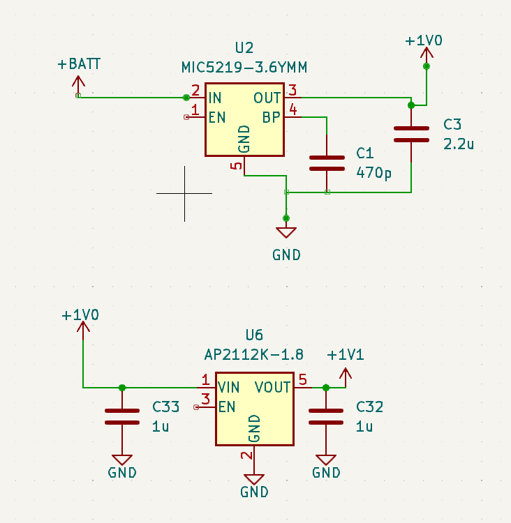
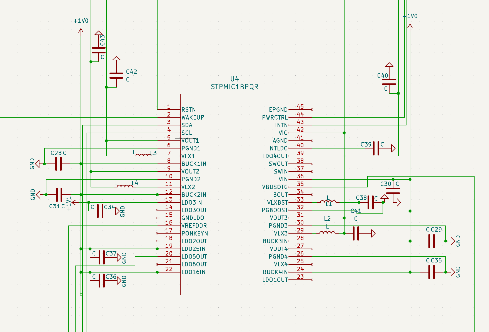
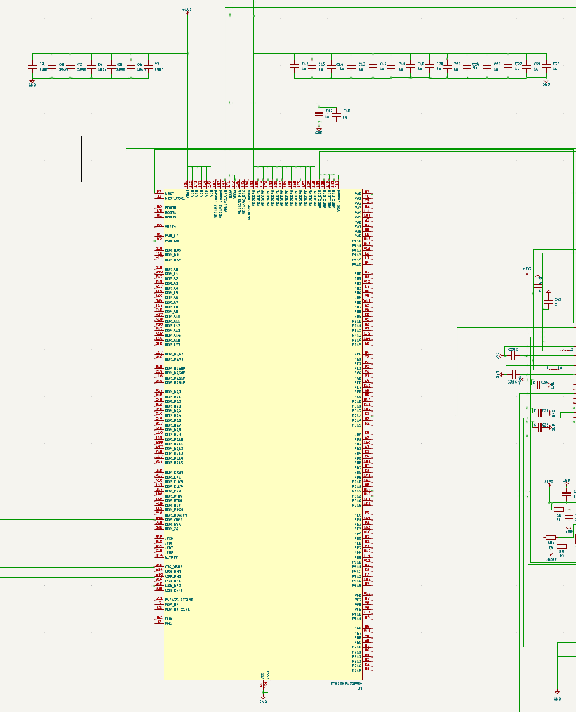
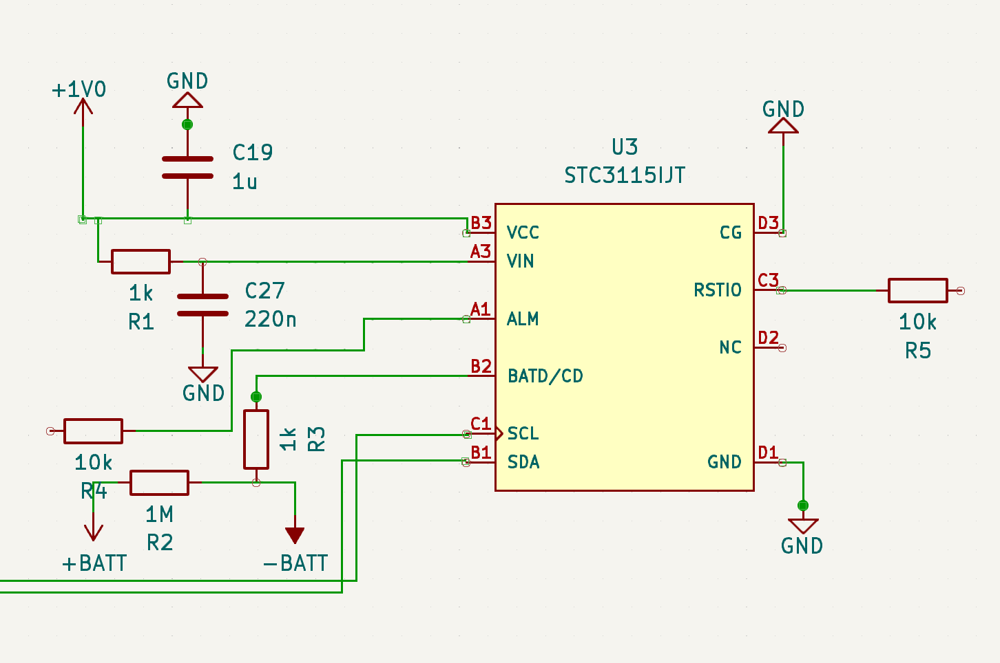
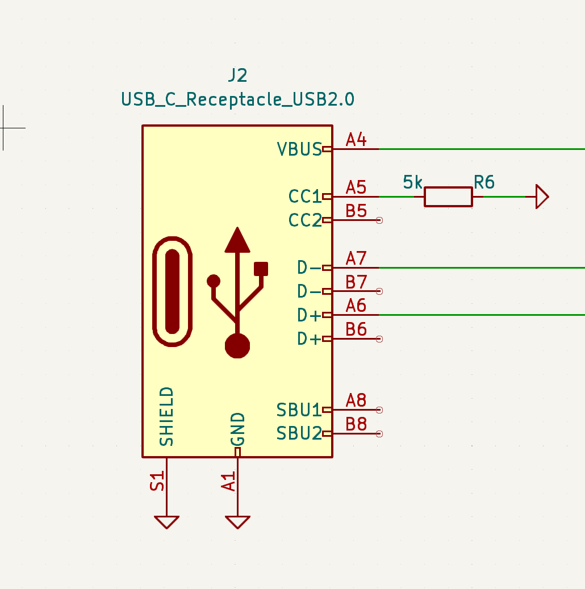
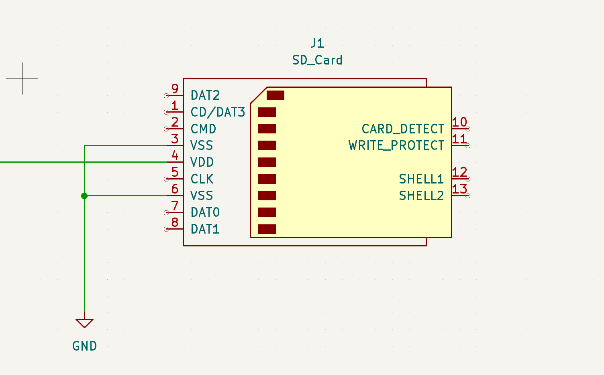
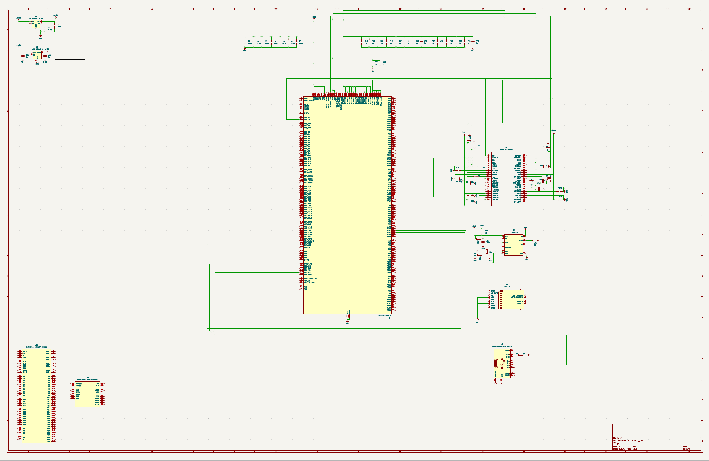

# **Images**

- this folder will house screenshots of PCB Schematics to demonstrate progress and organize logic. 

## SINGLE-BOARD COMPUTER (as of July 2, 2023)
### 1. Initial Power System
- I am using a Power Management IC. 
- These circuits create voltages needed to supply main power IC. 
- have not created sodder pads for battery input 

### 2. Power Management IC
- This IC will power every other IC in the SBC
- MPU, RAM, EMMC, USB-C, SD
  

### 3. MPU (unfinished)
- Main Component of the SBC
- Currently connected to most of the minimum requirements

### 4. Battery Level Gauge (unfinished)
- This IC will be used primarily for ARM Programming testing when I get the board. 
  - I have little experience with ARM Programming. I can test different techniques on an IC that is relativly simple to program. 
  - compared to the MPU ... 

### 5. USC-C Receptacle
- Will be used for loading programs on to the SBC. 

### 6. SD Card Receptacle (unfinished)
- Will be used to load X-Linux-AI onto the SBC. 

### 7. Entire Schematic (not sure which external RAM, EMMC, as seen in bottom left)

